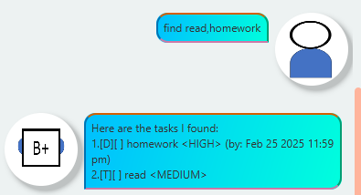

# BPlusChatter User Guide


A helpful chatbot designed to keep track of your tasks. <br>
With CLI commands, you can easily add, delete, view and track your tasks!

## TIPS
- Words in ```UPPER_CASE``` are the parameters to be supplied by the user.<br>
e.g. in ```todo TASK```, ```TASK``` is a parameter which can be used as
```todo homework```.<br>
- Items in square brackets are optional.
- e.g. ```find KEYWORD[,MORE_KEYWORDS]``` can be used as
```find homework``` or ```find homework,shopping```.
- Parameters need to be in order.
- Date format is YYYY-MM-DD.<br>
e.g. if you want to enter 3rd February 2025, use ```2025-02-03```
- Time format is 24-hour notation HHmm.<br>
e.g. if you want to enter 5.30pm, use ```1730```
- Priority levels accepted are ```HIGH```,```MEDIUM``` and ```LOW```.

## Adding todos: ```todo```
Adds a task that you have to do but the task does not have a time constraint.<br>
Format: ```todo TASK PRIORITY```<br>
Example:<br>
```todo homework HIGH```

## Adding deadlines: ```deadline```
Adds a task that needs to be done by a certain date and time.<br>
Format: ```deadline TASK /by DATE TIME PRIORITY```<br>
Example:<br>
```deadline homework /by 2025-02-25 2359 HIGH```

## Adding events: ```event```
Adds a task that has a starting date and time and an ending date and time.<br>
Format: ```event TASK /from DATE TIME /to DATE TIME PRIORITY```<br>
Example:<br>
```event meeting /from 2025-02-25 1400 /to 2025-02-25 1600 HIGH```

## List: ```list```
Shows a list of tasks ordered in descending priority.<br>
Format: ```list```

## Mark task: ```mark```
Marks a task as complete.<br>
Format: ```mark TASK_NUMBER```<br>
Example:<br>
```mark 1```

## Unmark task: ```unmark```
Marks a task as incomplete.<br>
Format: ```unmark TASK_NUMBER```<br>
Example:<br>
```unmark 1```

## Delete task: ```delete```
Deletes a task.<br>
Format: ```delete TASK_NUMBER```<br>
Example:<br>
```delete 1```

## Find tasks on date: ```on```
Finds tasks that need to be completed by a certain date.<br>
This includes deadlines and event starting dates.<br>
Format: ```on DATE```<br>
Example:<br>
```on 2025-02-25```

## Find tasks by keyword: ```find```
Finds tasks with descriptions containing any of the given keywords.<br>
Format: ```find KEYWORD[,MORE_KEYWORDS]```
- The search is case-insensitive. e.g. ```READ``` will match ```read```.
- To search multiple keywords, separate each keyword with a single comma.
e.g. ```find read,homework,meeting```
- The order of the keywords does not matter. 
e.g. ```read,homework``` will match ```homework,read```.
- Partial matches will be performed.
e.g. ```home``` will match ```homework```.
- Tasks matching one keyword will be returned.
e.g. ```read,homework``` will return ```read book```,```do homework```.<br>
Examples:<br>
- ```find home``` returns ```homework```
- ```find read,homework``` returns ```homework,read```<br>


## Exiting the program: ```bye```
Exits the program.<br>
Format: ```bye```